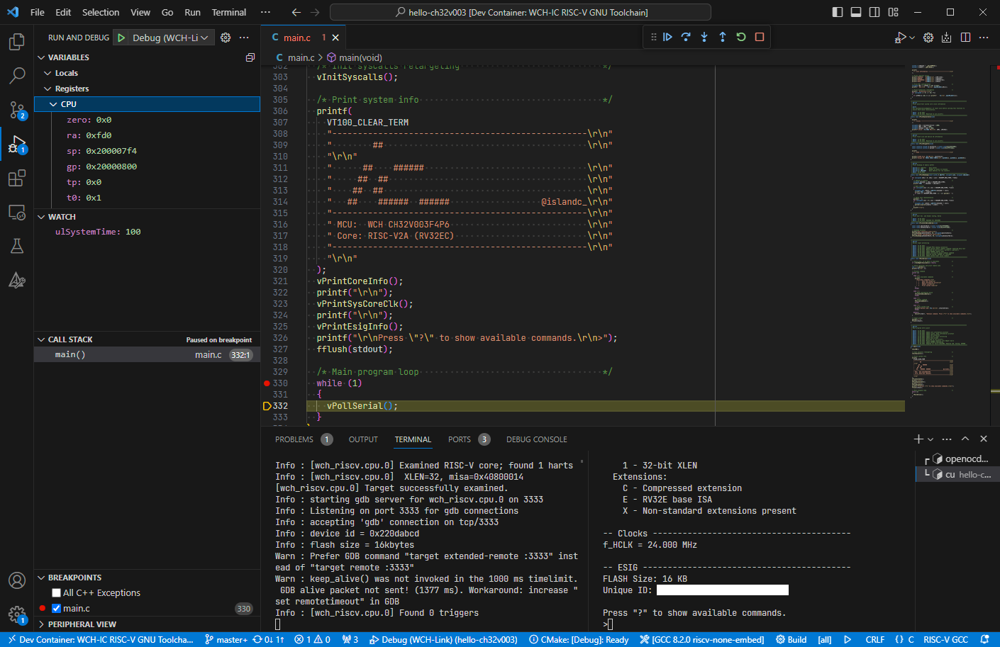

# hello-ch32v003 [](LICENSE) [](https://t.co/Qbblvmfbae)

A simple "Hello World"-like project for the ultra low-cost WCH CH32V003 RISC-V MCU.

<p align="center"></p>

This project contains a simple set of modules to get the MCU running in a minimal configuration:
  - Serial I/O on USART1 (connected to WCH-LinkE USART)
  - TIM1 Channel 3 configured for PWM output to LED
  - SysTick enabled and using auto-reload feature

**:information_source: See [`README.vscode.md`](README.vscode.md) for VSCode setup information! :information_source:**

## Requirements

* Hardware
  * WCH CH32V003F4P6-EVT+WCH-LinkE Starter Kit (available from LCSC, [PartNr `C5236707`](https://www.lcsc.com/product-detail/Microcontroller-Units-MCUs-MPUs-SOCs_WCH-Jiangsu-Qin-Heng-CH32V003F4P6-EVT-WCH-LinkE_C5236707.html))
    * Starter Kit includes WCH-LinkE Debugger
  * 6 pcs. female-female jumper wires
  * (optional) additional 1 pc. female-female jumper wire for LED demo
* Software
  * [MounRiver Studio Community](http://www.mounriver.com/) (as of March 2023, a [manual OpenOCD update](#manual-openocd-update) is needed)
  * Serial terminal program, e.g. [PuTTy](https://www.putty.org/) or minicom

### Manual OpenOCD Update for MounRiver V1.30 or earlier

MounRiver Studio Community **V1.30** does not include the updated OpenOCD build required for WCH-LinkE support. In order to update the debugger, perform the following steps:

* Download the [MounRiver Studio V1.84 Update](http://file.mounriver.com/upgrade/MounRiver_Update_V184.zip) package
* Extract the package into a temporary folder
* Copy the contained `toolchain` folder to your **local** MounRiver Studio Community installation
* Confirm overwrite of all files in the `toolchain` folder

### Hardware Setup

* (optional) Connect the `LED1` and `PC3` pins on header `P2` using a female-female jumper wire
* Follow instructions from the [WCH-LinkE User Manual](http://www.wch-ic.com/downloads/WCH-LinkUserManual_PDF.html) for connecting the debugger to your EVT board.

| WCH-LinkE Pin | EVT Board Pin |
|---------------|---------------|
| `RST`         | `NRST / PD7`  |
| `3V3`         | `VCC` (*)     |
| `GND`         | `GND`         |
| `SWDIO/TMS`   | `PD1`         |
| `TX`          | `PD6`         |
| `RX`          | `PD5`         |

*) For powering the target from your WCH-LinkE debugger. Omit this if you want to power the EVT board via its own USB port.

## Usage

* Clone this repository using the following command. Note the use of the `--recursive` tag.
  ```
  git clone --recursive https://github.com/islandcontroller/hello-ch32v003
  ```
* Load this project in **MounRiver Studio Community** and build the executable
* Open a serial terminal on the WCH-LinkE programmer's VCP (**115200 Baud, 8N1**)
* Flash the firmware to the MCU using the provided `.launch` script
* Resume execution once breakpoint in `main()` is reached
* Press `?` in the serial terminal to show available commands

## SOIC8 Pin Mapping and "un-bricking"
On the SOIC8 package `CH32V003J4M6`, the debug interface is multiplexed with USART1 data lines. In the default configuration, enabling the UART transmitter will block debugger access. To use both USART1 and the debug port, **un-comment the `USE_SOIC8_UART_REMAP`** macro definition in `hw_layer/hw_iodefs.h`. Use the following table for connecting the debug probe to the SOIC8 part:

|WCH-LinkE Pin|SOIC8 Pin|
|-|-|
|`3V3`|4 `VDD`|
|`GND`|2 `VSS`|
|`SWDIO`|8 `PD1/PD5/PD4` (*)|
|`TX`|8 `PD1/PD5/PD4`(*)|
|`RX`|1 `PD6`|

*) **Note:** *WCH-LinkE `TX` and `SWDIO` lines are connected to the same pin at the SOIC8 part!*

In order to use the USART pin, close the debug connection (OpenOCD) in software. This releases the SWDIO line to a high-impedance state.

### Un-bricking an SOIC8 part
If an SOIC8 part has been programmed without swapping the RX/TX lines, debugger access is no longer possible. A full chip reset is required.

Use the [WCH-LinkUtility](https://www.wch.cn/downloads/WCH-LinkUtility_ZIP.html) to perform a full chip reset:
* MCU Core: `RISC-V`
* Series: `CH32V00x`
* Target -> "Clear All Code-Flash-By Power Off"

## Licensing

If not stated otherwise in the specific file, the contents of this project are licensed under the MIT License. The full license text is provided in the [`LICENSE`](LICENSE) file.

    SPDX-License-Identifier: MIT

## Help and References

* [openwch/ch32v003](https://github.com/openwch/ch32v003) Manufacturer EVT demos and documentation
* [WCH-IC: CH32V003DS0.pdf](http://www.wch-ic.com/downloads/CH32V003DS0_PDF.html) MCU Datasheet
* [WCH-IC: CH32V003RM.pdf](http://www.wch-ic.com/downloads/CH32V003RM_PDF.html) MCU Reference Manual
* [WCH-IC: QingKeV2_Processor_Manual.pdf](http://www.wch-ic.com/downloads/QingKeV2_Processor_Manual_PDF.html) Processor Core Manual

If you're looking for further information about WCH products, check out their community Discord server: 
[](https://t.co/Qbblvmfbae)